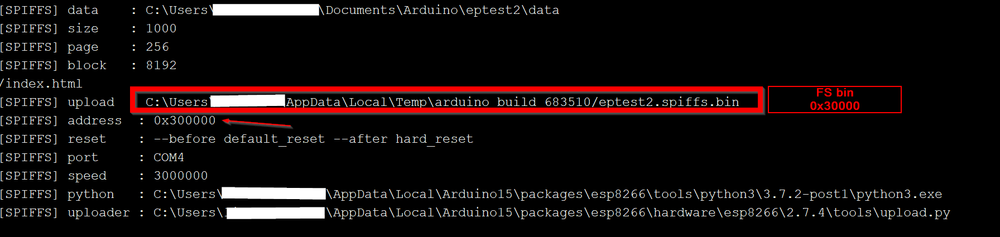

## create combined bin for easy flashing without ide

compile sketch into a bin file

once done the bin file will be in your sketchfolder

compile data into a bin file

once done the bin file will be a tempfolder

combine the files with "ESP8266 Download Tool"

* Sketch starts at 0x00000000
* SPIFFS starts at 0x00300000

