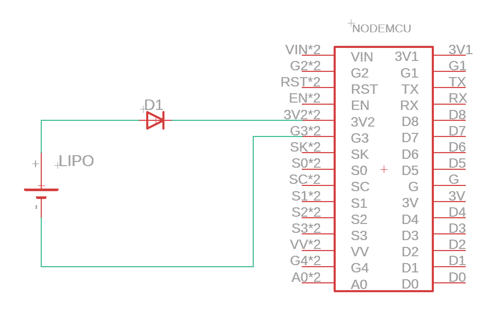
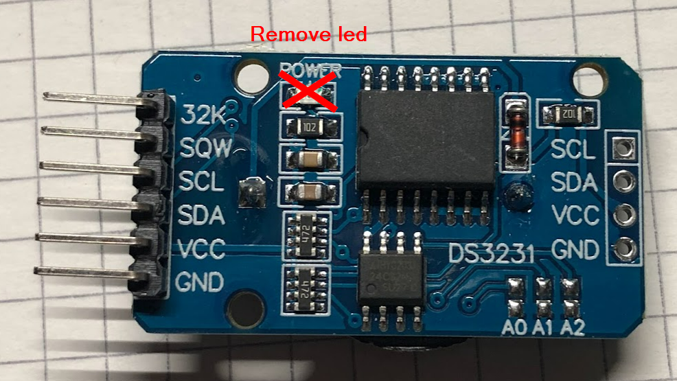
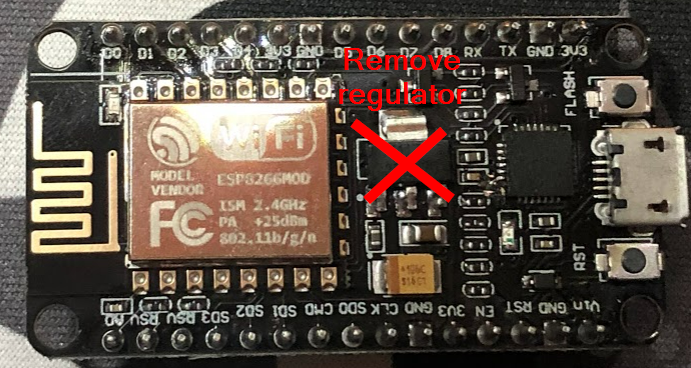
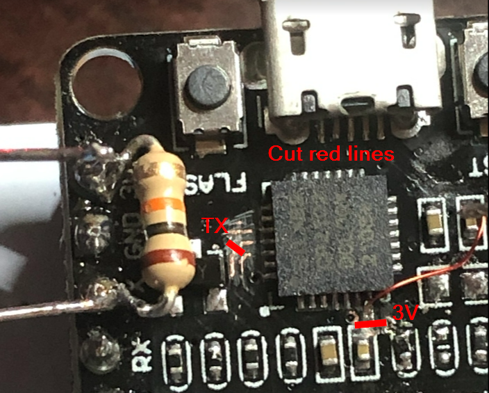

# Running on a battery
to run the calendar of a lipo battery you need to do some changes. Since the ESP8266 is only able to go up to 3,6V but a fully charged lipo battery has around 4,2V.
We also need to cut down on the standbycurrent - the nodecmu takes up about 15mA with the ESP8266 in deepsleep.

## Battery
The easiest way to drop the voltage of the lipo is to use a simple diode to drop the 4,2V to ~3,5V.

Make sure to use one of the 3V pins of the node MCU and not VIN or VV!

## DS3231 Realtimeclock
The DS3231 has an standby-led, removing it saves about 2mA.
Remove it with an soldering iron or carefully with caterpillars.

## Nodemcu

For this one i'm mostly refering to this article https://tinker.yeoman.com.au/2016/05/29/running-nodemcu-on-a-battery-esp8266-low-power-consumption-revisited/

### Voltageregulator
The voltageregulator that is for VIN / USB takes about 2mA and can be removed since the module is getting powered by the lipo direclty through the 3V pins.

### Serial to USB converter
The usb to serial converter takes most of the standbycurrent with about 10mA.

The easiest way is to cut of the 3V power line. With this removed you need to add an pullup resistor to the TX pin, otherwise the ESP8266 will not boot.
In my case this didn't help because the CP2102 is pulling TX down to 0,7V when not powered - because of this i also had to cut the TX (RX on the chip) to make it working.

__Disclaimer after cutting the 3V and TX to the serial IC you are not able to flash the NODEMCU again until you reconnect those two lines!__

With all those steps i was able to get the standbycurrent down to about 200µA.