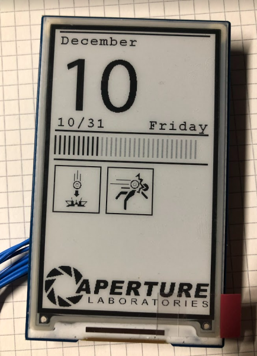

# Portalcalendar

Portalcalendar is a small calendar with portal level-sign desing using a eInk display together with an ESP8622 wifichip.

Features 9 different symbols from the Portallevels that are shown randomly every day.

### Birthdays

### Easy webinterface for configuration

## Parts used

* Nodemcu V2
* DS3231 RTC Module (recommended)
* or DS1307 RTC Module (works but not recommended for battery)
* 470 Ohm resistor
* 3.7inch e-Paper 480 x 280  
   * https://www.waveshare.com/pico-epaper-3.7.htm

## Wiring
RTC Module  | Nodemcu
------------- | -------------
SDA | D3
SCL | D4
GND | GND
5V / VCC |  3V

Epaper-display  | Nodemcu
------------- | -------------
BUSY | D6
RST | D2
DC | D1
CS | D8
CLK | D5
DIN | D7
GND | GND
VCC | 3V

Nodemcu  | Nodemcu
------------- | -------------
D1 | R1 (470 R, for deepsleep!)
RST | R1 (470 R, for deepsleep!)

Do not forget to connect D1 to RST via a 470 Ohm resistor from the nodecmu, otherwise the calendar isn't going to update!

## Flashing

this repository ships a precompiled binary for the nodemcu board that can be easily flashed with NodeMCU PyFlasher.

Download NodeMCU PyFlasher from their release section https://github.com/marcelstoer/nodemcu-pyflasher/releases

Select the correct serial port for your module.
Select the DS1307_target.bin or DS3231_target.bin file from the bin/ folder, depending on wich module you are using from this repository and hit the "flash" button after this you should see a message on your display

## Configuring
After successfull programming press the RST button on the node mcu twice, this is needed to wake the controller up from deepsleep.

Now you got 10seconds to press the Flash button to enable the configuration mode, otherwise the controller will go to sleep again.

After pressing the flashbutton the controller will create an open accesspoint called "PortalCalender" connect to it and navigate to http://192.168.4.1 with a webbrowser

## Running on a battery

It's possible but takes a bit more advanced work, see [doc/runonbattery.md](./doc/runonbattery.md)
  for more details